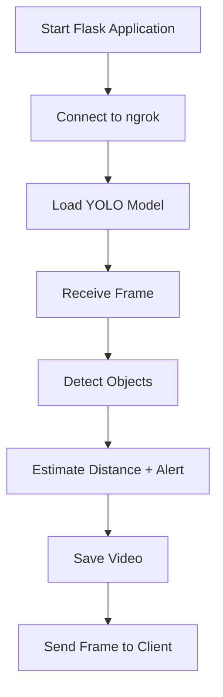
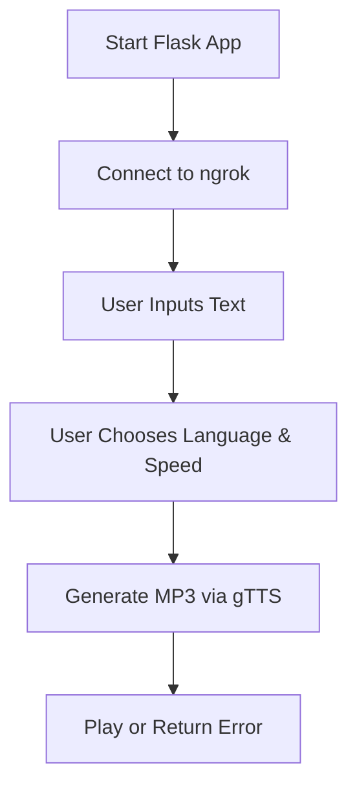
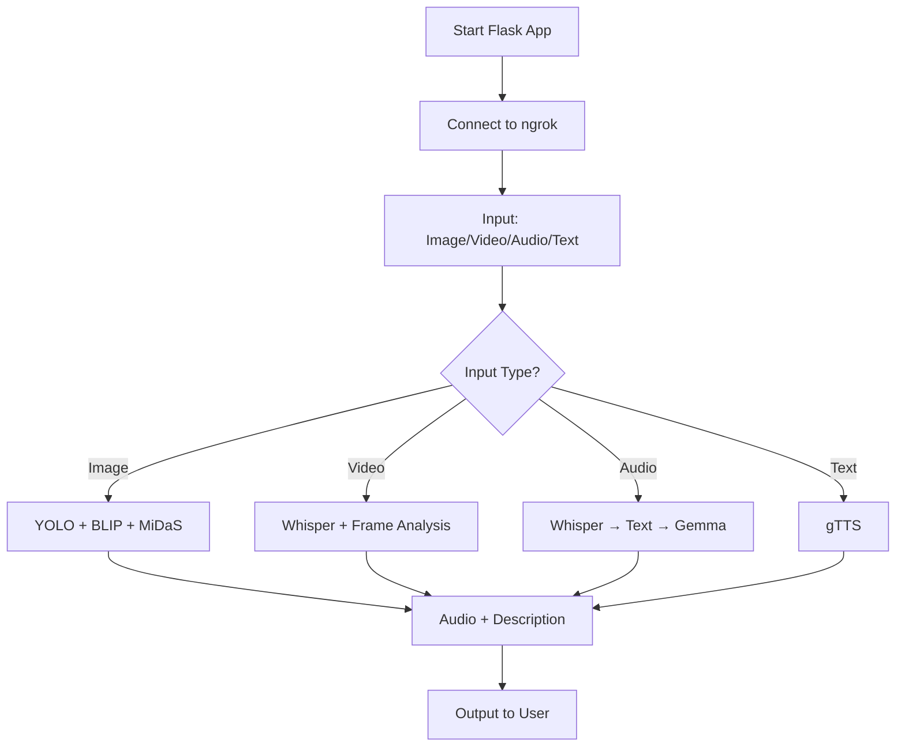

# 👁️‍🗨️ md – AI Assistant for the Blind and Hearing-Impaired

**md** is an intelligent assistant designed to help blind and hearing-impaired individuals. This repository contains a set of intelligent tools based on artificial intelligence designed to support blind and hearing-impaired individuals. The projects include real-time obstacle detection, multilingual text-to-speech (TTS), and a comprehensive "AI Eye" system using models like YOLO, BLIP, MiDaS, and Gemma.

---

## 📁 Project Overview

### 1. 🔍 Real-Time Obstacle Detection – `Real Time.ipynb`

A Flask-based application using mobile or laptop cameras for real-time object detection, distance estimation, and audio alerts.

#### ✅ Features
- Detects objects like walls, chairs, people, cars, etc.
- Estimates distance using YOLOv8.
- Issues audio alerts when obstacles are close.
- Saves processed video frames.
- Supports front/rear mobile cameras.

#### 🧪 How to Run
```bash
pip install flask flask-socketio eventlet opencv-python-headless ultralytics gtts pyngrok requests
python app.py
```

#### 📊 Flowchart


---

### 2. 🗣️ PolyVoice Multilingual TTS – `PolyVoice.ipynb`

A beautiful web-based app for converting text into speech in multiple languages using gTTS.

#### ✅ Features
- Supports 8 languages: English, Persian, French, German, Arabic, Italian, Russian, Spanish.
- Normal and slow speed options.
- Generates and plays MP3 files.
- Automatically deletes old files.

#### 🧪 How to Run
```bash
pip install flask werkzeug gtts pyngrok
```

#### 📊 Flowchart


---

### 3. 🧠 AI Eye for the Blind – `ai_eyes_for_the_blind_google_gemma_3n_impact_challenge.ipynb`

An advanced system that describes scenes, reads text, estimates depth, and produces audio feedback using state-of-the-art AI models.

#### ✅ Features
- Scene captioning with BLIP and simplification using Gemma.
- Object detection using YOLO.
- Depth estimation using MiDaS.
- OCR text reading using Doctr.
- Speech-to-text with Whisper.
- Supports input types: image, video, audio, text.

#### 🧪 How to Run
```bash
pip install numpy ultralytics flask transformers pillow gTTS speechrecognition pycocotools pyngrok opencv-python geocoder flask-cors pytesseract python-doctr
```

#### 📊 Flowchart


---

## ⚙️ Requirements
- Python 3.8 or higher
- GPU (optional but recommended for performance)
- Hugging Face token (for BLIP and Gemma models)

## 📦 General Installation
```bash
git clone https://github.com/parhamdehghan/ai-assistive-tools.git
cd ai-assistive-tools
```

## 📽️ Demos
Demo videos are available in the `demos/` folder or via YouTube for easier access:

▶️ [Watch Demo on YouTube](https://youtu.be/abc123) *(Replace with actual link)*

---

## 🪪 License
This project is licensed under the MIT License. See the LICENSE file for details.

## 📬 Contact
**Developer**: Parham Dehghan  
**Email**: dehghanparham6@gmail.com


# AI Eyes for the Blind

A powerful, real-time assistive system for blind and deaf individuals, using AI models like Gemma 2B, YOLOv8, BLIP, and MiDaS.

## 🔍 What it does
- Describes surroundings using **BLIP**
- Simplifies descriptions for accessibility with **Google Gemma**
- Detects objects and directions with **YOLOv8n**
- Estimates obstacle distances with **MiDaS**
- Converts output to speech via **gTTS**
- Supports video and image inputs
- Designed for visually impaired and hearing-impaired users

## 🧠 Technologies Used
- **Gemma 2B** – Language simplification
- **YOLOv8n** – Real-time object detection
- **BLIP** – Image captioning
- **MiDaS** – Monocular depth estimation
- **gTTS** – Text-to-speech
- **Gradio** – Web interface
- **OpenCV + NumPy** – Image preprocessing

## 📦 How to Run
Clone the repository:
```bash
git clone https://github.com/your-repo/ai-eyes-for-the-blind.git
```

Install dependencies:
```bash
pip install -r requirements.txt
```

Run the app (e.g., in Colab or locally):
```bash
python ai_eyes_for_the_blind_google_gemma_3n_impact_challenge.py
```

## 📋 Requirements
- Python 3.8+
- Libraries in `requirements.txt`:
  - torch
  - torchvision
  - transformers
  - gTTS
  - gradio
  - opencv-python
  - numpy
  - ultralytics

## 🌐 Demo Video (Coming Soon)
A YouTube video will showcase real-time detection, narration, and gesture interaction.

## 🚀 Future Enhancements
With potential Google collaboration:
- Smart glasses integration for seamless user experience
- Expanded multilingual support (e.g., Persian, Arabic, Spanish, Mandarin, Hindi)
- Augmented reality for navigation
- Sign language gesture-to-text via MediaPipe
- Improved real-time performance to 30 FPS

## 🙌 Contributing
Contributions are welcome! Submit pull requests or open issues for improvements or bug fixes.

## 📧 Contact
Contact **Mohammad Parham Dehghan** at `dehghanparham6@gmail.com`.

## 🚫 License
This work is copyright © 2025 by Mohammad Parham Dehghan  
Licensed under the **Creative Commons Attribution-NonCommercial-NoDerivatives 4.0 International (CC BY-NC-ND 4.0)** license.  
You are free to:
- **Share** — copy and redistribute the material in any medium or format  
Under the following terms:
- **Attribution** — You must give appropriate credit.
- **NonCommercial** — You may not use the material for commercial purposes.
- **NoDerivatives** — If you remix, transform, or build upon the material, you may not distribute the modified material.
