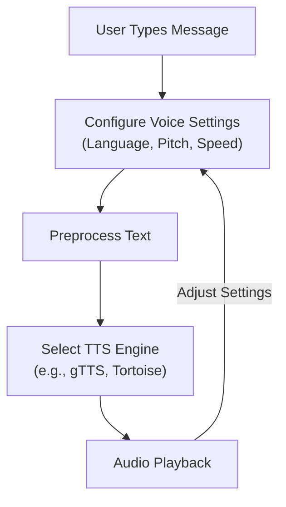
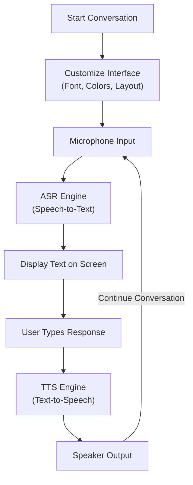
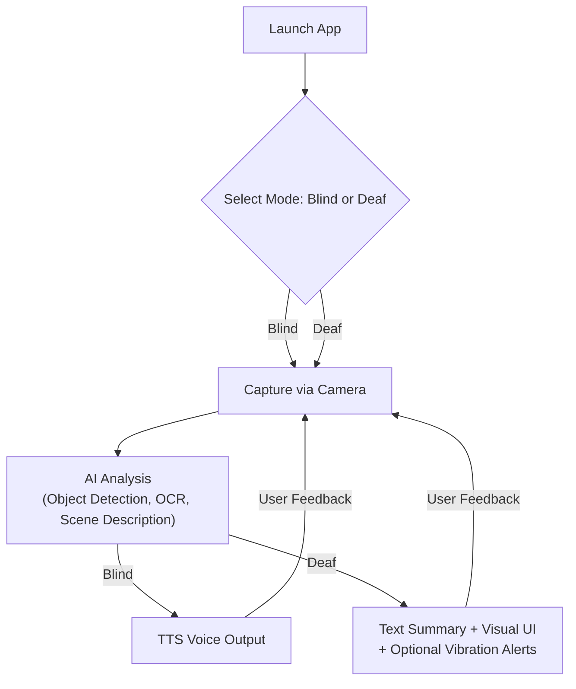

# 🧠 AI Accessibility Suite – PolyVoice, Real-Time Communication, and md

 

This repository includes three AI-powered applications developed to support people with **speech**, **hearing**, and **vision** impairments. These tools were designed with accessibility, inclusiveness, and real-world usability in mind.

---

## 🗣️ PolyVoice: Text-to-Speech for Non-Verbal and Mute Users

**PolyVoice** is a user-friendly and highly accessible text-to-speech application specifically designed for individuals who are unable to speak due to physical or medical conditions. The tool empowers users by enabling them to convert written text into spoken voice in real time.

### 🔧 Key Features
| Feature | Description |
|---------|-------------|
| **Text-to-Speech Conversion** | Converts typed text into natural-sounding audio using AI-based engines (e.g., gTTS, Tortoise). |
| **Multilingual Support** | Supports various languages and accents for global accessibility. |
| **Custom Voice Settings** | Users can select male/female voice tones, control pitch and speed. |
| **Offline Mode** | Optionally available for areas without internet connectivity. |
| **Emotion Synthesis (optional)** | Enhance spoken feedback with emotions (e.g., happy, sad). |

### 🧑‍🤝‍🧑 Target Audience
- People who are mute or have speech impairments (e.g., ALS, stroke, autism).
- Therapists and caregivers aiding communication.
- Users in temporary voice loss situations.

### 🧠 System Workflow


**Flowchart Description**: The PolyVoice flowchart is a linear diagram with a feedback loop, rendered as a top-down sequence of rectangular nodes connected by arrows. It starts with a node labeled "User Types Message," flowing to "Configure Voice Settings (Language, Pitch, Speed)," then to "Preprocess Text," followed by "Select TTS Engine (e.g., gTTS, Tortoise)," and finally to "Audio Playback." A dashed arrow labeled "Adjust Settings" loops back from "Audio Playback" to "Configure Voice Settings," indicating the user can refine settings after playback. The nodes are styled with rounded corners and a light background, typical of Mermaid’s default rendering on GitHub.

### 💻 How to Run
```bash
pip install -r requirements.txt
python polyvoice_main.py
```

---

## 🔁 Real-Time Communication: Speech ↔ Text Interface

**Real-Time Communication** bridges communication between **deaf or mute individuals and hearing people** by providing an interface to convert speech into text and typed text into speech on the fly.

### 🔧 Key Features
| Feature | Description |
|---------|-------------|
| **Speech Recognition (ASR)** | Converts speech to text instantly using Whisper or other ASR models. |
| **Text-to-Speech Output** | Converts typed responses into spoken language. |
| **Custom Interfaces** | Font size, color themes, and layout customization for visibility. |
| **Microphone and Speaker Integration** | Designed for real-time conversations. |

### 🧑‍🤝‍🧑 Target Audience
- People who are deaf, hard of hearing, or mute.
- Public service desks (banks, clinics) for inclusive communication.
- Educators and interpreters.

### 🧠 System Workflow


**Flowchart Description**: The Real-Time Communication flowchart is a cyclical diagram, rendered top-down with rectangular nodes and arrows. It begins with "Start Conversation," leading to "Customize Interface (Font, Colors, Layout)," then to "Microphone Input," followed by "ASR Engine (Speech-to-Text)," "Display Text on Screen," "User Types Response," "TTS Engine (Text-to-Speech)," and "Speaker Output." A dashed arrow labeled "Continue Conversation" loops back from "Speaker Output" to "Microphone Input," representing the ongoing conversational cycle. The nodes have rounded corners, with text centered and arrows clearly indicating flow direction.

### 💻 How to Run
```bash
pip install -r requirements.txt
python real_time_main.py
```

---

## 🤖 md: AI Assistant for the Blind and Deaf

**md** (Multi-Disability Assistant) is an intelligent assistant tailored for **both blind and deaf users**. It uses real-time camera input, object detection, OCR, and AI description generation to explain the environment visually or through audio.

### 🔧 Key Features
| Feature | Description |
|---------|-------------|
| **Dual Mode (Blind / Deaf)** | Select mode on startup based on user needs. |
| **Object Detection** | Uses AI models (YOLO/SSD) to identify people, objects, and obstacles. |
| **Text Recognition (OCR)** | Reads and interprets signs, books, handwritten or printed content. |
| **Scene Description** | Describes complex scenes using advanced vision models. |
| **Multi-Output Interface** | For Blind Users: Audio narration via TTS; For Deaf Users: On-screen readable text with optional vibration alerts. |

### 🧑‍🤝‍🧑 Target Audience
- Blind or low-vision users seeking contextual feedback.
- Deaf users who require visual alerts or text summaries.
- Public assistive installations, wearable devices.

### 🧠 System Workflow


**Flowchart Description**: The md flowchart is a branching diagram, rendered top-down with a decision node and parallel paths. It starts with "Launch App," leading to a diamond-shaped decision node "Select Mode: Blind or Deaf." Two arrows branch out: one labeled "Blind" and one labeled "Deaf," both pointing to a shared "Capture via Camera" node. This flows to "AI Analysis (Object Detection, OCR, Scene Description)." From there, two paths diverge: the "Blind" path leads to "TTS Voice Output," and the "Deaf" path leads to "Text Summary + Visual UI + Optional Vibration Alerts." Dashed arrows labeled "User Feedback" loop back from both output nodes to "Capture via Camera," indicating continuous interaction. Nodes are styled with rounded corners (rectangular) or diamonds (decision), with clear labels and arrows.

### 💻 How to Run
```bash
pip install -r requirements.txt
python md.py
```

---

## 📁 Project Structure

```
ai-accessibility-suite/
│
├── polyvoice_main.py         # PolyVoice app
├── real_time_main.py         # Real-Time Communication tool
├── md.py                     # md assistant
├── requirements.txt
├── README.md
└── assets/
    └── screenshots/
```

---

## 🔐 Accessibility Principles Followed

- **WCAG Compliance**: Designed with high contrast and readable fonts.
- **Voice-free Interaction**: Fully usable without audio in Deaf Mode.
- **Large Buttons and Simple UI**: Suitable for low-vision or elderly users.
- **No Mouse Needed**: All features keyboard accessible.

---

## 📜 License


All content is provided under the **Creative Commons Attribution-NonCommercial 4.0 International (CC BY-NC 4.0)** license. You are free to share and adapt the material for non-commercial purposes with proper attribution.

🔗 [License Details](https://creativecommons.org/licenses/by-nc/4.0/)

---

## 💡 Future Features (Planned)

- [ ] Sign language recognition and feedback
- [ ] Braille printer integration
- [ ] Mobile app versions for Android/iOS
- [ ] Cloud data sharing for caregivers

---

## 🙌 Contribution

We welcome contributions from developers, designers, accessibility researchers, and community members. Please submit issues or pull requests on [GitHub](https://github.com/Parham-Dehghan).

> **Designed to empower communication for all – regardless of ability.** 🌍

---

## 👨‍💻 Creator Information

| Name | Mohammad Parham Dehghan |
|------|-------------------------|
| **Email** | dehghanparham6@gmail.com |
| **YouTube** | [AI Accessibility Projects & Demos](https://www.youtube.com/@dehghanparham6) |
| **GitHub** | [@Parham-Dehghan](https://github.com/Parham-Dehghan) |

---

## 📜 License (Repeated for Clarity)


This project is licensed under the **Creative Commons Attribution-NonCommercial 4.0 International (CC BY-NC 4.0)**. For more information, visit [creativecommons.org/licenses/by-nc/4.0](https://creativecommons.org/licenses/by-nc/4.0/).
