# 🧠 AI Accessibility Suite – Empowering Communication with Style

 

Dive into a vibrant suite of four AI-powered tools designed to break barriers for individuals with **speech**, **hearing**, and **vision** impairments. Each app combines cutting-edge technology with a sleek, animated interface inspired by Bootstrap styling, delivering an engaging and accessible user experience.


---

## 🗣️ PolyVoice: Speak Your Words with Flair

**PolyVoice** transforms typed text into natural, expressive speech, empowering non-verbal or mute users to communicate effortlessly. With a modern UI featuring smooth animations and vibrant colors, it’s as intuitive as it is powerful.

### 🔧 Key Features
| Feature | Description | Visual Experience |
|---------|-------------|-------------------|
| 🎙️ **Text-to-Speech Conversion** | Turns text into lifelike audio using AI engines (e.g., gTTS, Tortoise). | Smooth `fadeIn` transitions for text input. |
| 🌍 **Multilingual Support** | Supports global languages and accents. | Dynamic dropdowns with `pulse` animations. |
| ⚙️ **Custom Voice Settings** | Adjust male/female tones, pitch, and speed. | Interactive sliders with hover effects. |
| 📴 **Offline Mode** | Works without internet access. | Minimalist offline UI with vibrant feedback. |
| 😊 **Emotion Synthesis** | Adds emotional tones (e.g., happy, sad). | Animated icons for emotional feedback. |

### 🧑‍🤝‍🧑 Target Audience
- Mute or speech-impaired individuals (e.g., ALS, stroke, autism).
- Therapists and caregivers enhancing communication.
- Users with temporary voice loss.

### 🧠 System Workflow


```mermaid
flowchart TD
    Start[🚀 Launch App] --> Input[✍️ Type Message]
    Input --> Config[⚙️ Choose Voice Settings]
    Config --> Process[🔧 Process Text]
    Process --> Engine[🗣️ Select TTS Engine]
    Engine --> Output[🔊 Play Audio with Animation]
    Output -->|🔄 Tweak Settings| Config
```

**Flowchart Description**: PolyVoice’s flowchart is a lively, linear diagram with a feedback loop, rendered top-down with emoji-enhanced nodes. It kicks off with "Launch App," flows to "Type Message," "Choose Voice Settings," "Process Text," "Select TTS Engine," and ends at "Play Audio with Animation." A dashed "Tweak Settings" arrow loops back, styled with rounded corners and vibrant colors for a modern vibe.

### 💻 How to Run
```bash
pip install -r requirements.txt
python polyvoice_main.py
```

---

## 🔁 Real-Time Communication: Connect Instantly with Style

**Real-Time Communication** bridges the gap between deaf, mute, and hearing individuals with a dynamic speech-to-text and text-to-speech interface, wrapped in a Bootstrap-inspired UI with fluid animations.

### 🔧 Key Features
| Feature | Description | Visual Experience |
|---------|-------------|-------------------|
| 🎤 **Speech Recognition (ASR)** | Instantly converts speech to text via Whisper or other ASR models. | Real-time text display with `pulse` animation. |
| 🗣️ **Text-to-Speech Output** | Transforms typed responses into speech. | Smooth `fadeIn` for audio playback. |
| 🎨 **Custom Interfaces** | Adjustable fonts, themes, and layouts. | Bootstrap-styled layouts with hover effects. |
| 🔊 **Microphone & Speaker Integration** | Built for seamless conversations. | Animated mic icons for active recording. |

### 🧑‍🤝‍🧑 Target Audience
- Deaf, hard-of-hearing, or mute individuals.
- Public service desks (banks, clinics) for inclusive interaction.
- Educators and interpreters.

### 🧠 System Workflow


```mermaid
flowchart TD
    Start[🚀 Start Chat] --> Config[🎨 Customize UI]
    Config --> Mic[🎤 Record Audio]
    Mic --> ASR[🗣️ Speech-to-Text]
    ASR --> Display[🖼️ Show Text with Animation]
    Display --> Type[✍️ Type Response]
    Type --> TTS[🔊 Text-to-Speech]
    TTS --> Speaker[🔊 Play Audio]
    Speaker -->|🔄 Continue Chat| Mic
```

**Flowchart Description**: This cyclical flowchart bursts with energy, rendered top-down with emoji-driven nodes. It starts with "Start Chat," flows to "Customize UI," "Record Audio," "Speech-to-Text," "Show Text with Animation," "Type Response," "Text-to-Speech," and "Play Audio." A dashed "Continue Chat" arrow loops back, styled with vibrant, rounded nodes for a dynamic feel.

### 💻 How to Run
```bash
pip install -r requirements.txt
python real_time_main.py
```

---

## 🤖 md: Your AI Guide for Blind and Deaf Users

**md** (Multi-Disability Assistant) empowers blind and deaf users with real-time environmental insights via camera input, object detection, and OCR, delivered through a sleek, animated interface.

### 🔧 Key Features
| Feature | Description | Visual Experience |
|---------|-------------|-------------------|
| 🌐 **Dual Mode (Blind/Deaf)** | Choose mode based on user needs. | Animated mode selector with `fadeIn`. |
| 🔍 **Object Detection** | Identifies people, objects, and obstacles using YOLO/SSD. | Real-time visual overlays with hover effects. |
| 📜 **Text Recognition (OCR)** | Reads signs, books, and handwritten text. | Smooth text display with `pulse` animation. |
| 🖼️ **Scene Description** | Describes complex scenes with AI vision. | Dynamic descriptions with Bootstrap styling. |
| 🔊 **Multi-Output Interface** | Audio for blind; text/vibration for deaf. | Vibrant UI with animated feedback. |

### 🧑‍🤝‍🧑 Target Audience
- Blind or low-vision users seeking environmental context.
- Deaf users needing visual or haptic feedback.
- Public assistive systems and wearable devices.

### 🧠 System Workflow


```mermaid
flowchart TD
    Start[🚀 Launch App] --> Mode{🌐 Blind or Deaf?}
    Mode -->|Blind| Cam[📸 Capture Scene]
    Mode -->|Deaf| Cam
    Cam --> Vision[🔍 AI Analysis]
    Vision -->|Blind| Audio[🔊 TTS Audio Output]
    Vision -->|Deaf| Output[🖼️ Text + Animated UI]
    Output -->|🔄 Feedback| Cam
    Audio -->|🔄 Feedback| Cam
```

**Flowchart Description**: The md flowchart is a branching masterpiece, rendered top-down with a decision node and parallel paths. It starts with "Launch App," hits a diamond-shaped "Blind or Deaf?" node, then branches to a shared "Capture Scene" node, flowing to "AI Analysis." The "Blind" path leads to "TTS Audio Output," and the "Deaf" path to "Text + Animated UI." Dashed "Feedback" arrows loop back, styled with vibrant emojis and modern aesthetics.

### 💻 How to Run
```bash
pip install -r requirements.txt
python md.py
```

---

## 🎙️ VocalBridge: Speech-to-Text with a Modern Twist

**VocalBridge** delivers real-time speech-to-text transcription for deaf or hard-of-hearing users, wrapped in a stunning web-based UI with Bootstrap-inspired styling, `fadeIn` transitions, and `pulse` animations for a lively experience.

### 🔧 Key Features
| Feature | Description | Visual Experience |
|---------|-------------|-------------------|
| 🎤 **Real-Time Speech Recognition** | Converts audio to text using Whisper. | Real-time text with `pulse` loading animation. |
| 🌍 **Multilingual Support** | Supports English, Persian, Arabic, and more. | Dynamic LTR/RTL text with `fadeIn` transitions. |
| 🎨 **Dynamic Interface** | Bootstrap-styled layouts with LTR/RTL support. | Hover effects and vibrant color schemes. |
| 🔧 **Audio Preprocessing** | Handles WebM/WAV with resampling. | Seamless processing with animated feedback. |
| 🌐 **Web-Based Access** | Runs via Flask and ngrok. | Modern UI with responsive design. |

### 🧑‍🤝‍🧑 Target Audience
- Deaf or hard-of-hearing individuals needing instant transcription.
- Multilingual settings requiring language-specific text.
- Public service environments (e.g., customer service, education).

### 🧠 System Workflow


```mermaid
flowchart TD
    Start[🚀 Launch App] --> Config[🌍 Choose Language]
    Config --> Record[🎤 Record Audio]
    Record --> Preprocess[🔧 Process Audio]
    Preprocess --> ASR[🗣️ Convert to Text]
    ASR --> Display[🖼️ Show Text with Animation]
    Display -->|🔄 Continue| Record
```

**Flowchart Description**: VocalBridge’s cyclical flowchart radiates energy, rendered top-down with emoji-enhanced nodes. It starts with "Launch App," flows to "Choose Language," "Record Audio," "Process Audio," "Convert to Text," and "Show Text with Animation." A dashed "Continue" arrow loops back, styled with vibrant colors and rounded nodes for a modern, animated vibe.

### 💻 How to Run
```bash
pip install flask==2.2.5 flask-socketio==5.3.6 eventlet==0.36.1 pyngrok==7.2.0
pip install git+https://github.com/openai/whisper.git
pip install soundfile==0.13.1 pydub==0.25.1 librosa==0.10.2
apt-get install -y ffmpeg
python vocalbridge.py
```

**Note**: Requires an ngrok authentication token for public URL access. Grab your token from [ngrok](https://ngrok.com) and update the code.

**License Note**: VocalBridge code is licensed under the MIT License for maximum flexibility, while the rest of the suite follows CC BY-NC 4.0.

---

## 📁 Project Structure

```
ai-accessibility-suite/
│
├── polyvoice_main.py         # PolyVoice app
├── real_time_main.py         # Real-Time Communication tool
├── md.py                     # md assistant
├── vocalbridge.py            # VocalBridge speech-to-text app
├── requirements.txt
├── README.md
└── assets/
    └── screenshots/
```

---

## 🔐 Accessibility Principles Followed

- **WCAG Compliance**: High-contrast, Bootstrap-inspired design with readable fonts.
- **Voice-Free Interaction**: Fully functional without audio for deaf users.
- **Intuitive UI**: Large buttons, animated feedback, and responsive layouts.
- **Keyboard Accessibility**: Navigate effortlessly without a mouse.

---

## 📜 License


This project is licensed under the **Creative Commons Attribution-NonCommercial 4.0 International (CC BY-NC 4.0)**, except for VocalBridge, which uses the MIT License. Share and adapt for non-commercial purposes with proper attribution.

🔗 [License Details](https://creativecommons.org/licenses/by-nc/4.0/)

---

## 💡 Future Features (Planned)

- [ ] Sign language recognition with animated feedback
- [ ] Braille printer integration
- [ ] Mobile apps for Android/iOS with vibrant UIs
- [ ] Cloud data sharing for caregivers

---

## 🙌 Contribution

Join our mission! Developers, designers, and accessibility enthusiasts are welcome to submit issues or pull requests on [GitHub](https://github.com/Parham-Dehghan).

> **Empowering communication for all with style and accessibility.** 🌍

---

## 👨‍💻 Creator Information

| Name | Mohammad Parham Dehghan |
|------|-------------------------|
| **Email** | dehghanparham6@gmail.com |
| **YouTube** | [AI Accessibility Projects & Demos](https://www.youtube.com/@dehghanparham6) |
| **GitHub** | [@Parham-Dehghan](https://github.com/Parham-Dehghan) |

---

## 📜 License (Repeated for Clarity)


.jpg)

This project is licensed under **Creative Commons Attribution-NonCommercial 4.0 International (CC BY-NC 4.0)**, with VocalBridge under MIT. Visit [creativecommons.org/licenses/by-nc/4.0](https://creativecommons.org/licenses/by-nc/4.0/) for details.
