# 🚀 AI Accessibility Suite – Empowering Everyone with Innovation & Style

    

🌟 **Welcome to the AI Accessibility Suite**, a vibrant collection of four AI-powered tools designed to break communication and navigation barriers for **all users**, including those with **speech**, **hearing**, and **vision** impairments, as well as general users seeking intuitive assistive technology. With sleek, animated interfaces inspired by Tailwind and Bootstrap, these apps deliver an inclusive, engaging, and cutting-edge experience. Powered by advanced AI models like YOLOv8, Whisper, and gTTS, this suite is your gateway to seamless interaction! 🎉

> ⚠️ **Important Notice**: This project is for **personal use only**. Forking, reusing, modifying, or distributing any part of this repository is strictly prohibited and will be pursued under DMCA or license violation claims.

## ⚠️ Trouble Running the Code?

Hit a snag while running the code (e.g., `md.py`, `VocalBridge.ipynb`, `Real Time.ipynb`, `PolyVoice.ipynb`)? No worries! 🙌 Reach out to me at [dehghanparham6@gmail.com](mailto:dehghanparham6@gmail.com), and I’ll share a **Google Colab link** to run the project smoothly in a pre-configured environment. Let’s make accessibility work for everyone—blind, deaf, kids, or general users! 🌈

---


## 🎯 Our Mission

The AI Accessibility Suite leverages state-of-the-art AI to empower **everyone**—from individuals with disabilities to general users—with intuitive tools for communication, navigation, and environmental awareness. Built with **WCAG 2.1 compliance**, dynamic animations (`fadeIn`, `pulse`), high-contrast designs, and multilingual support, these apps ensure accessibility with flair. From real-time obstacle detection to speech-to-text transcription, we’re redefining inclusivity for all! 🌍

| App | Purpose | Key Tech | Target Users |
|-----|---------|----------|--------------|
| 🧠 **md** | Multi-disability assistant with vision and navigation | YOLOv8, BLIP, Whisper, MiDaS, Doctr, Gemma-2b | Blind, Deaf, General |
| 🎙️ **VocalBridge** | Real-time speech-to-text transcription | Whisper, Flask-SocketIO, librosa | Deaf, Hard-of-Hearing, General |
| 🔁 **Real-Time Obstacle Detection** | Live obstacle alerts via webcam | YOLO-World, SocketIO | Blind, Low-Vision, General |
| 🗣️ **PolyVoice** | Multilingual text-to-speech conversion | gTTS | Mute, Speech-Impaired, General |

---

## 🧠 The Apps: Your Accessibility Champions

### 1. 🧠 **md: Your AI Companion for All Users**

**md** (Multi-Disability Assistant) transforms environmental data into accessible insights using camera input, object detection, text recognition, and GPS navigation. It delivers audio for blind users, visual/haptic feedback for deaf users, and intuitive outputs for general users, all within a stunning, animated UI.

#### ✨ Key Features
- 🌐 **Dual Mode**: Blind (audio output), Deaf (visual/vibration), or General (combined outputs).
- 🔍 **Object Detection**: Identifies objects with YOLOv8 (confidence > 0.6).
- 📜 **OCR**: Extracts text from images using Doctr and Tesseract.
- 🖼️ **Scene Description**: Generates detailed captions with BLIP, refined by Gemma-2b.
- 📍 **GPS Navigation**: Calculates distance and direction with geocoder and Haversine.
- 📏 **Depth Estimation**: Estimates object distances using MiDaS.
- 🗣️ **Voice Commands**: Processes audio inputs with Whisper for hands-free control.
- 🎨 **Vibrant UI**: `fadeIn` selectors, `pulse` text displays, and Tailwind CSS styling.

#### 🎯 Target Audience
- Blind or low-vision users needing environmental context.
- Deaf users requiring visual or haptic feedback.
- General users seeking assistive navigation or scene analysis.
- Caregivers, public assistive systems, and wearable tech integrations.

#### 🧠 System Workflow


```mermaid
graph TD
    A[🚀 Launch App] --> B{🌐 User Type: Blind, Deaf, General?}
    B -->|Blind| C[📸 Capture Image/Video]
    B -->|Deaf| C
    B -->|General| C
    C --> D[🔍 AI Analysis]
    D --> D1[🔎 Object Detection: YOLOv8]
    D --> D2[📜 OCR: Doctr/Tesseract]
    D --> D3[🖼️ Scene Caption: BLIP]
    D --> D4[📏 Depth Estimation: MiDaS]
    D --> D5[📍 GPS Navigation: Geocoder]
    D --> D6[🗣️ Voice Commands: Whisper]
    D1 & D2 & D3 & D4 & D5 & D6 --> E[🔧 Refine Output: Gemma-2b]
    E -->|Blind| F[🔊 TTS Audio + Vibration]
    E -->|Deaf| G[🖼️ Visual Output + Animated UI]
    E -->|General| H[🔊🖼️ Audio + Visual + Haptic]
    F -->|🔄 Feedback Loop| C
    G -->|🔄 Feedback Loop| C
    H -->|🔄 Feedback Loop| C
```

**Flowchart Description**: A branching flowchart with parallel AI analysis nodes, starting with "Launch App" and a "User Type: Blind, Deaf, General?" decision. It flows to "Capture Image/Video," then splits into "Object Detection," "OCR," "Scene Caption," "Depth Estimation," "GPS Navigation," and "Voice Commands." Outputs are refined with Gemma-2b, leading to "TTS Audio + Vibration" (Blind), "Visual Output + Animated UI" (Deaf), or "Audio + Visual + Haptic" (General). Dashed feedback loops ensure continuous interaction, styled with vibrant emojis and modern nodes.

#### 💻 How to Run
```bash
pip install -r requirements.txt
python md.py
```

---

### 2. 🎙️ **VocalBridge: Speech-to-Text with Elegance**

**VocalBridge** delivers real-time speech-to-text transcription for deaf, hard-of-hearing, or general users. Powered by Whisper, it supports multiple languages and features a sleek web interface with dynamic animations.

#### ✨ Key Features
- 🎤 **Real-Time Transcription**: Converts audio to text using Whisper (`base` model).
- 🌍 **Multilingual Support**: Persian, English, Arabic, French, German, Italian, Russian, Spanish.
- 🔧 **Audio Preprocessing**: Handles WebM/WAV with 16kHz resampling via librosa and pydub.
- 🗣️ **Dynamic Language Detection**: Auto-detects input language for transcription.
- 🎨 **Vibrant UI**: `pulse` loading animations, `fadeIn` transitions, and RTL/LTR support with Bootstrap-inspired styling.

#### 🎯 Target Audience
- Deaf or hard-of-hearing individuals needing instant transcription.
- General users in multilingual settings (e.g., customer service, education).
- Public service desks requiring real-time text output.

#### 🧠 System Workflow


```mermaid
graph TD
    A[🚀 Launch App] --> B[🌍 Select Language]
    B --> C[🎤 Record Audio: MediaRecorder]
    C --> D[🔧 Preprocess Audio: WebM to WAV]
    D --> E[🗣️ Transcribe: Whisper]
    E --> F[🔍 Language Detection]
    F --> G[🖼️ Display Text with Pulse Animation]
    G -->|🔄 Continue| C
```

**Flowchart Description**: A cyclical flowchart showcasing VocalBridge’s streamlined process. It starts with "Launch App," flows to "Select Language," "Record Audio," "Preprocess Audio," "Transcribe," "Language Detection," and "Display Text with Pulse Animation." A dashed "Continue" loop ensures ongoing transcription, styled with vibrant emojis and rounded nodes.

#### 💻 How to Run
```bash
pip install flask==2.2.5 flask-socketio==5.3.6 eventlet==0.36.1 pyngrok==7.2.0
pip install git+https://github.com/openai/whisper.git
pip install soundfile==0.13.1 pydub==0.25.1 librosa==0.10.2
apt-get install -y ffmpeg
python vocalbridge.py
```
> **Note**: Requires an ngrok auth token from [ngrok.com](https://ngrok.com).

---

### 3. 🔁 **Real-Time Obstacle Detection: Navigate with Confidence**

**Real-Time Obstacle Detection** empowers blind, low-vision, or general users with live webcam-based obstacle alerts. Using YOLO-World, it detects objects, estimates distances, and delivers Persian audio alerts with vibration feedback for mobile devices.

#### ✨ Key Features
- 🔍 **Obstacle Detection**: Identifies objects (e.g., stairs, people, cars) with YOLO-World (`yolov8x-worldv2.pt`, confidence > 0.7).
- 📏 **Distance Estimation**: Calculates steps to obstacles based on bounding box size.
- 🔊 **Audio Alerts**: Client-side speech synthesis in Persian/English via SpeechSynthesis.
- 📱 **Mobile-Friendly**: Front/rear camera toggle and vibration alerts for dangerous objects.
- 🎥 **Video Recording**: Saves annotated videos for review.
- 🎨 **Dynamic UI**: `fadeIn` transitions and high-contrast design.

#### 🎯 Target Audience
- Blind or low-vision users navigating environments.
- General users seeking real-time environmental analysis.
- Caregivers and assistive technology integrators.

#### 🧠 System Workflow


```mermaid
graph TD
    A[🚀 Start App] --> B[📸 Start Webcam: User/Environment]
    B --> C[🔍 Detect Objects: YOLO-World]
    C --> D[📏 Estimate Distance]
    C --> E[🎥 Annotate Frame with Bounding Boxes]
    D --> F[🔊 Generate Audio Alert: SpeechSynthesis]
    D --> G[📱 Vibration for Dangerous Objects]
    E --> H[💾 Save Video: MP4]
    F & G & H -->|🔄 Continue| B
```

**Flowchart Description**: A cyclical flowchart highlighting real-time processing. It starts with "Start App," flows to "Start Webcam," "Detect Objects," and branches to "Estimate Distance," "Annotate Frame," "Generate Audio Alert," "Vibration for Dangerous Objects," and "Save Video." A dashed "Continue" loop ensures ongoing detection, styled with vibrant emojis and modern nodes.

#### 💻 How to Run
```bash
pip install -r requirements.txt
python real_time_main.py
```

---

### 4. 🗣️ **PolyVoice: Speak Your Words with Flair**

**PolyVoice** transforms text into natural speech, enabling mute, speech-impaired, or general users to communicate effortlessly. Its vibrant UI supports multiple languages and customizable speed settings.

#### ✨ Key Features
- 🎙️ **Text-to-Speech**: Converts text to audio using gTTS.
- 🌍 **Multilingual Support**: Persian, English, Arabic, French, German, Italian, Russian, Spanish.
- ⚙️ **Speed Control**: Normal or slow speech options.
- 🎨 **Vibrant UI**: `fadeIn` transitions, `pulse` animations, and RTL/LTR support with Bootstrap-inspired styling.
- 🌐 **Web Access**: Runs via Flask and ngrok for global reach.

#### 🎯 Target Audience
- Mute or speech-impaired individuals (e.g., ALS, stroke, autism).
- General users needing text-to-speech for presentations or accessibility.
- Therapists, caregivers, and users with temporary voice loss.

#### 🧠 System Workflow


```mermaid
graph TD
    A[🚀 Launch App] --> B[✍️ Type Text]
    B --> C[🌍 Select Language]
    C --> D[⚙️ Choose Speed: Normal/Slow]
    D --> E[🔧 Process Text: gTTS]
    E --> F[🔊 Play Audio with FadeIn Animation]
    F -->|🔄 Tweak Settings| C
```

**Flowchart Description**: A linear flowchart with a feedback loop, starting with "Launch App," flowing to "Type Text," "Select Language," "Choose Speed," "Process Text," and "Play Audio with FadeIn Animation." A dashed "Tweak Settings" loop allows adjustments, styled with vibrant emojis and rounded nodes.

#### 💻 How to Run
```bash
pip install -r requirements.txt
python polyvoice_main.py
```

---

## 📁 Project Structure

```plaintext
ai-accessibility-suite/
├── md.py                     # Multi-Disability Assistant
├── vocalbridge.py            # Speech-to-Text App
├── real_time_main.py         # Real-Time Obstacle Detection
├── polyvoice_main.py         # Text-to-Speech App
├── requirements.txt          # Dependencies
├── README.md                 # This file
└── assets/                   # Images and screenshots
    └── screenshots/
```

---

## 🔐 Accessibility Principles

- ✅ **WCAG 2.1 Compliance**: High-contrast, readable fonts, and Tailwind/Bootstrap-inspired design.
- ✅ **Voice-Free Interaction**: Fully functional for deaf users without audio reliance.
- ✅ **Intuitive UI**: Large buttons, animated feedback (`fadeIn`, `pulse`), and responsive layouts.
- ✅ **Keyboard Navigation**: Seamless control without a mouse for accessibility.
- ✅ **Haptic Feedback**: Vibration alerts for deaf users in md and Real-Time apps.
- ✅ **Multilingual RTL/LTR**: Dynamic text direction for Persian, Arabic, and more.
- ✅ **Universal Design**: Accessible to all users, including those without disabilities.

---

## 🔮 Future Features: Bold Visions for Universal Accessibility

The AI Accessibility Suite is set to redefine assistive technology with cutting-edge innovations, focusing on **wearable glasses** and **universal accessibility** for all users, including those with disabilities and general users. Here are our visionary plans:

- [ ] **Wearable AR Glasses Integration**:  
  - Develop smart glasses with AR displays for md and Real-Time apps, projecting real-time object labels, navigation cues, and text overlays in 3D space.  
  - Use lightweight AI models (e.g., MobileNet, Tiny YOLO) for on-device processing, ensuring low latency and battery efficiency.  
  - Provide haptic feedback via glasses’ temples to alert users to obstacles or notifications, enhancing accessibility for blind and deaf users.

- [ ] **Sign Language Recognition & Generation**:  
  - Integrate AI models (e.g., MediaPipe, SignNet) to recognize and generate sign language in real-time, with animated avatars for deaf users in md and VocalBridge.  
  - Support multiple sign languages (e.g., ASL, ISL, Persian Sign Language) for global accessibility.

- [ ] **Braille Display Compatibility**:  
  - Connect md and VocalBridge with Braille displays and printers, enabling tactile output of text for blind users, including real-time transcription and scene descriptions.

- [ ] **Emotion-Aware Speech Synthesis**:  
  - Enhance PolyVoice with advanced TTS models (e.g., Tacotron 2, VITS) to synthesize emotional tones (happy, sad, urgent) based on context analysis, improving expressiveness for all users.  
  - Use sentiment analysis to adapt tones dynamically, e.g., calming tones for stressful situations.

- [ ] **Edge AI for Offline Functionality**:  
  - Optimize models for edge devices (e.g., Raspberry Pi, mobile phones, wearable glasses) to enable offline object detection, transcription, and speech synthesis, reducing internet dependency.  
  - Implement federated learning to update models locally while preserving user privacy.

- [ ] **Personalized User Profiles**:  
  - Create cloud-based profiles to save user preferences (language, voice settings, UI themes, accessibility modes) across devices, with secure sharing for caregivers and educators.  
  - Enable cross-device synchronization for seamless use on phones, glasses, or wearables.

- [ ] **Cross-Platform Mobile Apps**:  
  - Build native Android/iOS apps using Flutter or React Native, featuring offline modes, push notifications, and vibrant, accessible UIs.  
  - Integrate with wearable glasses for hands-free operation, ideal for navigation and communication on the go.

- [ ] **AI-Driven Contextual Assistance**:  
  - Leverage large language models (e.g., Grok 3) in md to provide contextual guidance, such as suggesting safe navigation paths, summarizing complex scenes, or answering queries like “find my keys.” 
  - Support natural, conversational interactions for all users, including general users seeking assistance.

- [ ] **Advanced Haptic Wearables**:  
  - Develop wearable devices (e.g., wristbands, glasses) with precise haptic feedback patterns to convey object types, distances, and directions, enhancing accessibility for blind and deaf users.  
  - Integrate with md and Real-Time apps for multi-sensory feedback (audio, visual, haptic).

- [ ] **Global Language Expansion**:  
  - Add support for additional languages (e.g., Chinese, Hindi, Japanese, Swahili) and regional dialects in VocalBridge and PolyVoice, with culturally adaptive UI elements for global inclusivity.

- [ ] **Real-Time Collaboration Platform**:  
  - Enable multi-user sessions for caregivers, educators, or public service staff to monitor and assist users in real-time, with shared audio, text, and visual outputs.  
  - Integrate with wearable glasses for remote assistance, e.g., guiding blind users through crowded spaces.

- [ ] **Universal Accessibility Enhancements**:  
  - Implement adaptive UI scaling for users with motor impairments, ensuring larger touch targets and voice-activated controls.  
  - Add cognitive accessibility features, such as simplified language outputs and visual cues, for users with intellectual disabilities.  
  - Support general users with features like real-time translation, note-taking, or presentation aids, making the suite versatile for all.

- [ ] **Wearable Ecosystem Integration**:  
  - Create a unified ecosystem linking smart glasses, wristbands, and mobile apps, allowing seamless data sharing and control.  
  - Enable voice, gesture, and touch inputs for hands-free operation, ideal for users with limited mobility or in dynamic environments.

- [ ] **AI-Powered Safety Alerts**:  
  - Integrate real-time safety monitoring in md and Real-Time apps, using wearable glasses to detect hazards (e.g., traffic, falls) and alert users via audio, haptic, or visual cues.  
  - Provide emergency notifications to caregivers or emergency services, enhancing safety for all users.

---

## 📜 License


.jpg)
This project is licensed under **Creative Commons Attribution-NonCommercial 4.0 International (CC BY-NC 4.0)**, except for **VocalBridge**, which uses the **MIT License**. Share and adapt for non-commercial use with proper attribution.  
🔗 [License Details](https://creativecommons.org/licenses/by-nc/4.0/)

---

## 🙌 Get Involved!

We’re passionate about making communication and navigation accessible for all! Developers, designers, and accessibility enthusiasts are invited to share ideas, report issues, or suggest features on [GitHub](https://github.com/Parham-Dehghan). Let’s build a more inclusive world together! 🌍

---

## 👨‍💻 Meet the Creator

| **Name** | Mohammad Parham Dehghan |
|----------|-------------------------|
| 📧 **Email** | dehghanparham6@gmail.com |
| 🎥 **YouTube** | [AI Accessibility Projects & Demos](https://www.youtube.com/@dehghanparham6) |
| 🧑‍💻 **GitHub** | [@Parham-Dehghan](https://github.com/Parham-Dehghan) |

---

## 🌟 Why This Matters

> **Empowering everyone with innovation, accessibility, and bold vision.**  
This suite is more than code—it’s a bridge to independence, connection, and inclusion for all users, from those with disabilities to general users seeking intuitive tools. With wearable glasses and universal design, we’re shaping a future where everyone can thrive! 💪
