# 🚀 AI Accessibility Suite – Empowering All with Innovation & Flair

    

🌟 **Welcome to the AI Accessibility Suite**, a dazzling collection of four AI-driven tools designed to shatter communication barriers for individuals with **speech**, **hearing**, and **vision** impairments. With vibrant, animated interfaces inspired by modern design frameworks like Bootstrap, these apps deliver a seamless, inclusive, and engaging experience. Powered by cutting-edge AI models like YOLOv8, Whisper, and gTTS, this suite is your key to effortless interaction! 🎉

> ⚠️ **Important Notice**: This project is for **personal use only**. Forking, reusing, modifying, or distributing any part of this repository is strictly prohibited and will be pursued under DMCA or license violation claims.

---

## 🎯 What’s the Mission?

The AI Accessibility Suite harnesses advanced AI to empower users with disabilities, offering intuitive tools for navigation, communication, and environmental awareness. Each app adheres to **WCAG accessibility standards**, featuring dynamic animations (`fadeIn`, `pulse`), high-contrast designs, and multilingual support. Whether it’s real-time obstacle detection or speech-to-text transcription, we’re here to make the world more accessible with style! 🌍

| App | Purpose | Key Tech | Target Users |
|-----|---------|----------|--------------|
| 🧠 **md** | Multi-disability assistant with object detection, OCR, and navigation | YOLOv8, BLIP, Whisper, MiDaS, Doctr, Gemma-2b | Blind, Deaf |
| 🎙️ **VocalBridge** | Real-time speech-to-text transcription | Whisper, Flask-SocketIO, librosa | Deaf, Hard-of-Hearing |
| 🔁 **Real-Time Obstacle Detection** | Live obstacle alerts via webcam | YOLO-World, SocketIO | Blind, Low-Vision |
| 🗣️ **PolyVoice** | Multilingual text-to-speech conversion | gTTS | Mute, Speech-Impaired |

---

## 🧠 The Apps: Your Accessibility Champions

### 1. 🧠 **md: Your AI Companion for Blind & Deaf Users**

**md** (Multi-Disability Assistant) is a versatile assistant that transforms environmental data into accessible insights. It uses camera input for object detection, text recognition, and scene description, delivering audio for blind users and visual/haptic feedback for deaf users, all wrapped in a stunning UI.

#### ✨ Key Features
- 🌐 **Dual Mode**: Blind (audio output) or Deaf (visual/vibration) modes.
- 🔍 **Object Detection**: Identifies objects and obstacles using YOLOv8 (confidence > 0.6).
- 📜 **OCR**: Extracts text from images with Doctr and Tesseract.
- 🖼️ **Scene Description**: Generates detailed captions with BLIP, refined by Gemma-2b.
- 📍 **GPS Navigation**: Calculates distance and direction using geocoder and Haversine formula.
- 📏 **Depth Estimation**: Estimates object distances with MiDaS.
- 🎨 **Dynamic UI**: Animated `fadeIn` selectors, `pulse` text displays, and Tailwind CSS styling.

#### 🎯 Target Audience
- Blind or low-vision users needing environmental context.
- Deaf users requiring visual or haptic feedback.
- Caregivers, public assistive systems, and wearable tech integrations.

#### 🧠 System Workflow


```mermaid
graph TD
    A[🚀 Launch App] --> B{🌐 Blind or Deaf?}
    B -->|Blind| C[📸 Capture Image/Video]
    B -->|Deaf| C
    C --> D[🔍 AI Analysis]
    D --> D1[🔎 Object Detection: YOLOv8]
    D --> D2[📜 OCR: Doctr]
    D --> D3[🖼️ Scene Caption: BLIP]
    D --> D4[📏 Depth Estimation: MiDaS]
    D --> D5[📍 GPS Navigation]
    D1 & D2 & D3 & D4 & D5 --> E[🔧 Refine with Gemma-2b]
    E -->|Blind| F[🔊 TTS Audio Output]
    E -->|Deaf| G[🖼️ Text + Vibration + Animated UI]
    F -->|🔄 Feedback| C
    G -->|🔄 Feedback| C
```

**Flowchart Description**: A branching flowchart with a decision node, showcasing md’s multifaceted capabilities. It starts with "Launch App," branches at "Blind or Deaf?" to "Capture Image/Video," then flows to parallel AI analysis nodes: "Object Detection," "OCR," "Scene Caption," "Depth Estimation," and "GPS Navigation." Results are refined with Gemma-2b, leading to "TTS Audio Output" (Blind) or "Text + Vibration + Animated UI" (Deaf). Dashed feedback loops ensure continuous interaction, styled with vibrant emojis and rounded nodes.

#### 💻 How to Run
```bash
pip install -r requirements.txt
python md.py
```

---

### 2. 🎙️ **VocalBridge: Speech-to-Text with Elegance**

**VocalBridge** offers real-time speech-to-text transcription for deaf or hard-of-hearing users. Powered by Whisper, it supports multiple languages and features a sleek, web-based UI with dynamic animations.

#### ✨ Key Features
- 🎤 **Real-Time Transcription**: Converts audio to text using Whisper (`base` model).
- 🌍 **Multilingual Support**: Persian, English, Arabic, French, German, Italian, Russian, Spanish.
- 🔧 **Audio Preprocessing**: Handles WebM/WAV formats with 16kHz resampling via librosa.
- 🎨 **Vibrant UI**: `pulse` loading animations, `fadeIn` transitions, and RTL/LTR support with Bootstrap-inspired styling.
- 🌐 **Web Access**: Runs via Flask-SocketIO and ngrok for global accessibility.

#### 🎯 Target Audience
- Deaf or hard-of-hearing individuals needing instant transcription.
- Multilingual settings (e.g., customer service, education).
- Public service environments requiring real-time text output.

#### 🧠 System Workflow


```mermaid
graph TD
    A[🚀 Launch App] --> B[🌍 Select Language]
    B --> C[🎤 Record Audio via MediaRecorder]
    C --> D[🔧 Preprocess Audio: WebM to WAV]
    D --> E[🗣️ Transcribe: Whisper]
    E --> F[🖼️ Display Text with Pulse Animation]
    F -->|🔄 Continue| C
```

**Flowchart Description**: A cyclical flowchart highlighting VocalBridge’s streamlined process. It starts with "Launch App," flows to "Select Language," "Record Audio," "Preprocess Audio," "Transcribe," and "Display Text with Pulse Animation." A dashed "Continue" loop ensures ongoing transcription, styled with vibrant emojis, rounded nodes, and a modern aesthetic.

#### 💻 How to Run
```bash
pip install flask==2.2.5 flask-socketio==5.3.6 eventlet==0.36.1 pyngrok==7.2.0
pip install git+https://github.com/openai/whisper.git
pip install soundfile==0.13.1 pydub==0.25.1 librosa==0.10.2
apt-get install -y ffmpeg
python vocalbridge.py
```
> **Note**: Requires an ngrok auth token from [ngrok.com](https://ngrok.com).

---

### 3. 🔁 **Real-Time Obstacle Detection: Navigate with Confidence**

**Real-Time Obstacle Detection** empowers blind users with live webcam-based obstacle alerts. Using YOLO-World, it detects objects, estimates distances, and delivers Persian audio alerts with vibration feedback for mobile devices.

#### ✨ Key Features
- 🔍 **Obstacle Detection**: Identifies objects (e.g., stairs, people, cars) with YOLO-World (`yolov8x-worldv2.pt`, confidence > 0.7).
- 📏 **Distance Estimation**: Calculates steps to obstacles based on bounding box size.
- 🔊 **Audio Alerts**: Client-side speech synthesis in Persian/English.
- 📱 **Mobile-Friendly**: Supports front/rear camera toggle and vibration alerts.
- 🎥 **Video Recording**: Saves annotated videos for review.
- 🎨 **Dynamic UI**: `fadeIn` transitions and high-contrast design.

#### 🎯 Target Audience
- Blind or low-vision users navigating environments.
- Caregivers and assistive technology integrators.

#### 🧠 System Workflow


```mermaid
graph TD
    A[🚀 Start App] --> B[📸 Start Webcam]
    B --> C[🔍 Detect Objects: YOLO-World]
    C --> D[📏 Estimate Distance]
    C --> E[🎥 Annotate Frame]
    D --> F[🔊 Generate Audio Alert: SpeechSynthesis]
    D --> G[📱 Vibration for Dangerous Objects]
    E --> H[💾 Save Video]
    F & G & H -->|🔄 Continue| B
```

**Flowchart Description**: A cyclical flowchart showcasing real-time processing. It starts with "Start App," flows to "Start Webcam," "Detect Objects," and branches to "Estimate Distance," "Annotate Frame," "Generate Audio Alert," "Vibration for Dangerous Objects," and "Save Video." A dashed "Continue" loop ensures ongoing detection, styled with vibrant emojis and modern nodes.

#### 💻 How to Run
```bash
pip install -r requirements.txt
python real_time_main.py
```

---

### 4. 🗣️ **PolyVoice: Speak Your Words with Flair**

**PolyVoice** transforms text into natural speech, enabling mute or speech-impaired users to communicate effortlessly. Its vibrant UI supports multiple languages and speed settings.

#### ✨ Key Features
- 🎙️ **Text-to-Speech**: Converts text to audio using gTTS.
- 🌍 **Multilingual Support**: Persian, English, Arabic, French, German, Italian, Russian, Spanish.
- ⚙️ **Speed Control**: Normal or slow speech options.
- 🎨 **Vibrant UI**: `fadeIn` transitions, `pulse` animations, and RTL/LTR support with Bootstrap-inspired styling.
- 🌐 **Web Access**: Runs via Flask and ngrok.

#### 🎯 Target Audience
- Mute or speech-impaired individuals (e.g., ALS, stroke, autism).
- Therapists, caregivers, and users with temporary voice loss.

#### 🧠 System Workflow


```mermaid
graph TD
    A[🚀 Launch App] --> B[✍️ Type Text]
    B --> C[🌍 Select Language]
    C --> D[⚙️ Choose Speed: Normal/Slow]
    D --> E[🔧 Process Text: gTTS]
    E --> F[🔊 Play Audio with FadeIn Animation]
    F -->|🔄 Tweak Settings| C
```

**Flowchart Description**: A linear flowchart with a feedback loop, starting with "Launch App," flowing to "Type Text," "Select Language," "Choose Speed," "Process Text," and "Play Audio with FadeIn Animation." A dashed "Tweak Settings" loop allows adjustments, styled with vibrant emojis and rounded nodes.

#### 💻 How to Run
```bash
pip install -r requirements.txt
python polyvoice_main.py
```

---

## 📁 Project Structure

```plaintext
ai-accessibility-suite/
├── md.py                     # Multi-Disability Assistant
├── vocalbridge.py            # Speech-to-Text App
├── real_time_main.py         # Real-Time Obstacle Detection
├── polyvoice_main.py         # Text-to-Speech App
├── requirements.txt          # Dependencies
├── README.md                 # This file
└── assets/                   # Images and screenshots
    └── screenshots/
```

---

## 🔐 Accessibility Principles

- ✅ **WCAG Compliance**: High-contrast, readable fonts, and Tailwind/Bootstrap-inspired design.
- ✅ **Voice-Free Interaction**: Fully functional for deaf users without audio reliance.
- ✅ **Intuitive UI**: Large buttons, animated feedback (`fadeIn`, `pulse`), and responsive layouts.
- ✅ **Keyboard Navigation**: Seamless control without a mouse for accessibility.
- ✅ **Haptic Feedback**: Vibration alerts for deaf users in md and Real-Time apps.

---

## 🔮 Future Features

- [ ] **Sign Language Recognition**: Animated feedback for deaf users.
- [ ] **Braille Integration**: Support for Braille printers.
- [ ] **Mobile Apps**: Native Android/iOS apps with vibrant UIs.
- [ ] **Cloud Sharing**: Data sharing for caregivers and therapists.
- [ ] **Emotion Synthesis**: Add emotional tones to PolyVoice (e.g., happy, sad).
- [ ] **Advanced OCR**: Support for handwritten text in multiple languages.

---

## 📜 License

  
This project is licensed under **Creative Commons Attribution-NonCommercial 4.0 International (CC BY-NC 4.0)**, except for **VocalBridge**, which uses the **MIT License**. Share and adapt for non-commercial use with proper attribution.  
🔗 [License Details](https://creativecommons.org/licenses/by-nc/4.0/)

---

## 🙌 Get Involved!

We’re passionate about making communication accessible for all! Developers, designers, and accessibility enthusiasts are invited to share ideas or report issues on [GitHub](https://github.com/Parham-Dehghan). Let’s build a more inclusive world together! 🌍

---

## 👨‍💻 Meet the Creator

| **Name** | Mohammad Parham Dehghan |
|----------|-------------------------|
| 📧 **Email** | dehghanparham6@gmail.com |
| 🎥 **YouTube** | [AI Accessibility Projects & Demos](https://www.youtube.com/@dehghanparham6) |
| 🧑‍💻 **GitHub** | [@Parham-Dehghan](https://github.com/Parham-Dehghan) |

---

## 🌟 Why This Matters

> **Empowering communication with innovation, accessibility, and style.**  
This suite is more than code—it’s a bridge to connection, independence, and inclusion. Join us in creating a world where everyone can communicate freely! 💪
